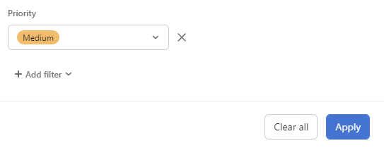
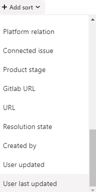

import { LinkCard } from '@astrojs/starlight/components';

## Subtopics

<LinkCard title="Handling Process" href="/sop/bug-ticket-management/handling-process/" description="Learn about the handling process for bug tickets." />
<LinkCard title="Manual Follow Up" href="/sop/bug-ticket-management/manual-follow-up/" description="Understand the manual follow-up process." />
<LinkCard title="Project Fields" href="/sop/bug-ticket-management/project-fields/" description="Explore the project fields used in bug ticket management." />
Our bug ticket handling process varies depending on the priority of the issue. This ensures that critical issues are addressed promptly while maintaining an organized approach to all reported bugs.

## Related Documentation

<LinkCard title="Back to Overview" href="/sop/bug-ticket-management/overview/" description="Return to the Bug Ticket Management Overview." />

<LinkCard title="Asana Guide" href="/tools/asana/" description="Learn how we use Asana for task and project management." />
<LinkCard title="Intercom Guide" href="/tools/intercom/" description="Understand how to manage conversations in Intercom." />
<LinkCard title="Slack Guide" href="/tools/slack/" description="Communicate effectively using Slack." />

## Priority Levels

1. **Critical Issues**
   - Highest priority
   - Reviewed and assigned immediately
   - May involve special Slack channels for quick resolution

2. **Urgent Issues**
   - Reviewed and assigned after critical issues
   - Handled promptly by product and engineering teams

3. **High Issues**
   - Discussed in weekly bug triage meetings
   - Assigned to a product manager and added to their Asana project
   - Worked on after critical and urgent issues

4. **Medium/Low Issues**
   - Placed in a backlog for review
   - No guaranteed timeline for review or fix
   - Can be upgraded in priority if necessary (consult with a support manager)

## Tracking Progress

- Monitor the 'Product stage', 'Status', 'Resolution state' fields, and the Activity log/comment section for updates.
- Join the task to receive notifications about changes.

## Requesting Updates

- Review the status fields and activity/comments section before requesting an update.
- Only request updates if there have been no updates in the past 7 days.
- Direct update requests to the assigned team member or appropriate product manager.

## Updating Issues

1. Provide additional details from users in the comment section.
2. Update the 'User notified' field when informing users about fixes.
3. Close issues by moving them to the 'Closed' section and marking them as complete.

For more detailed information, refer to the [Asana Bug Handling Process](Asana%20bug%20handling%20process%20a2c55843366a4aa98617c36269501e2c.md) document.
