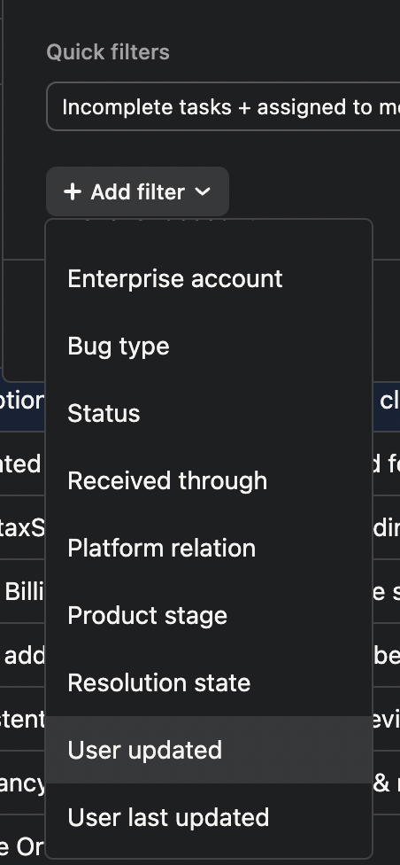

To ensure we maintain excellent customer service, we have a structured process for following up with users about their reported bugs. The frequency and nature of follow-ups depend on the user's account level and the priority of the reported issues.

## Follow-Up Categories

### Enterprise-level Accounts
- Follow up every five business days, regardless of issue severity
- Filter bugs by Enterprise account in Asana
- Sort by "User last updated"

### Standard-level Accounts (With High-Priority Tickets)
- Follow up every five business days for accounts with at least one high-priority ticket
- Filter bugs by Critical priority in Asana
- Sort by "User last updated"

### Standard-level Accounts (Without High-Priority Tickets)
- Follow up quarterly
- Filter bugs by Medium priority in Asana
- Sort by "User last updated"

### Community-level Accounts (Active Users with 3+ Open Tickets)
- Follow up every five business days
- Filter by Community plan and identify accounts with three or more open tickets
- Sort by "Last follow-up date"

### Inactive Users (Users with Only One Ticket)
- Follow up monthly (except for canceled accounts)
- Filter by Trial/Community plan
- Sort by "Last follow-up date"

## Follow-Up Process

1. Review the bug's current status in Asana
2. Check the last update date
3. Prepare an appropriate follow-up message based on the current status
4. Send the follow-up message to the user
5. Update the "User last updated" field in Asana

Remember to always use a professional and empathetic tone in your follow-up messages. If you're unsure about the status of an account or the appropriate follow-up action, consult with your team leader.

For more detailed information, refer to the [Manual Follow-Up](Manual%20Follow%20Up%20(Because%20we%20don%E2%80%99t%20forget%20about%20ou%20b8083cdb871e4c37b3a77e8a9aec5057.md) document.
