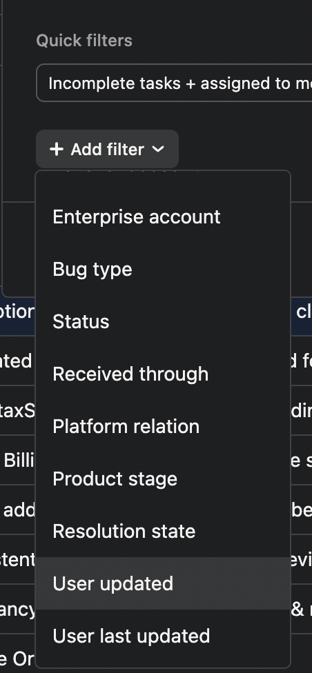

import { LinkCard, LinkButton } from '@astrojs/starlight/components';

# Introduction

From a recent interview, we found out that one of our company’s weaknesses is the support. As an effort to increase our overall performance, we’ll be implementing a new process. The follow-ups - It’s the ultimate signifier that we don’t take our users for granted. Following up with users is a type of marketing and can be a valuable asset while growing our platform. 

In this document, we’ll be outlining the process for following up with our users. Whether it’s a question or bug, we’ll list it down step by step, process by process.

## Process

The process guide will be broken down into several categories:

- **Enterprise level accounts**
- **Standard level accounts**
- **Community level accounts**
- **Inactive users**

## Bugs

### Enterprise-level accounts:

- For bugs reported by Enterprise users, **regardless** of the severity of the issue, we must follow up **every five business days** to give them an update.
- In the Asana Bugs board, filter the bugs based on the Enterprise **account** and select **Choose Any.** From there, select all Enterprise accounts.
- Sort the cards by “User last updated”

- Look into the Bugs that are **assigned** to an Engineer
- Go through the comments in the bug report. Follow the [Asana Bug Handling Process](https://www.notion.so/Asana-bug-handling-process-a2c55843366a4aa98617c36269501e2c?pvs=21) for guidance when following up with the assigned Engineer
- Reach out to the Enterprise user if it’s been five **business days or more** that we haven’t given them an update about the bug/s
- Refer to Guideline for a guide on the follow-up email to be sent to the user

### Standard-level accounts (With at least one high-priority ticket):

- For bugs reported by **Standard** plan users who have **at least one high-priority ticket**, we must follow up **every five business days** to give them an update.
- In the Asana Bugs board, filter the bugs based on **Priority** and select **Critical.**
- Sort the cards by “User last updated”
- Look into the Bugs that are **assigned** to an Engineer
- Go through the comments in the bug report. Follow the [Asana Bug Handling Process](https://www.notion.so/Asana-bug-handling-process-a2c55843366a4aa98617c36269501e2c?pvs=21) for guidance when following up with the assigned Engineer
- Pull up the user’s account in Intercom and take note of the user’s plan. They should be on a **Standard plan**. If they’re in a Community plan, refer to Community Level Accounts instructions below.
- Reach out to the Standard plan user if it’s been five **business days or more** that we haven’t given them an update about the bug/s
- Refer to Guideline for a guide on the follow-up email to be sent to the user.
- Once done with **Critical** bugs, filter again the bug reports by **Priority** > **Urgent and High.**

### Standard-level accounts (With NO high-priority ticket):

- For bugs reported by **Standard** plan users who have **NO high-priority tickets**, we must follow up **quarterly** to give them an update.
- In the Asana Bugs board, filter the bugs based on **Priority** and select **Medium**.

- Sort the cards by “User last updated”.

- Look into the Bugs that are assigned to an Engineer.
- Go through the comments in the bug report. Follow the Asana Bug Handling Process for guidance when following up with the assigned Engineer.
- Pull up the user’s account in Intercom and take note of the user’s plan. They should be on a Standard plan. If they’re in a Community plan, refer to Community Level Accounts instructions below.
- Reach out to the Standard plan user if it’s been **three business months or more** that we haven’t given them an update about the bug/s.
- Refer to the guideline for a guide on the follow-up email to be sent to the user.

### Community-level accounts (Active users with more than three or more open tickets )

- For bugs reported by **Community** plan users who have **at least three or more tickets, regardless of the priority**, we must follow up **every five business days** to give them an update.
- *Filter the Plan and choose **Community.***
- *Sort the results by User Account and determine which Community accounts have three or more open tickets.*
- Sort the cards by “Last follow-up date”
- Look into the Bugs that are **assigned** to an Engineer
- Go through the comments in the bug report. Follow the [Asana Bug Handling Process](https://www.notion.so/Asana-bug-handling-process-a2c55843366a4aa98617c36269501e2c?pvs=21) for guidance when following up with the assigned Engineer
- Reach out to the Community plan user if it’s been five **business days or more** that we haven’t given them an update about all the outstanding bugs that they reported (3 or more)
- Refer to Guideline for a guide on the follow-up email to be sent to the user

### Inactive users (Users with only one ticket)

- For bugs reported by **Inactive** users, we must follow up **monthly** to give them an update. **(There is no need to send a follow-up to users who have canceled their accounts.)**
- **It's important to seek advice from your team leader to check if the account is inactive.**
- *Filter the Plan and choose **Trial/Community.***
- Sort the cards by “Last follow-up date”
- Look into the Bugs that are **assigned** to an Engineer
- Go through the comments in the bug report. Follow the [Asana Bug Handling Process](https://www.notion.so/Asana-bug-handling-process-a2c55843366a4aa98617c36269501e2c?pvs=21) for guidance when following up with the assigned Engineer
- Reach out to the Trial user if it’s been **30 days since the last update unless advised to stop sending follow-ups**
- Refer to Guideline for a guide on the follow-up email to be sent to the user

# Summary

This document outlines a process for following up with customers, depending on their account level, to ensure they are not taken for granted. It includes instructions for filtering bug reports based on the account level, sorting by last follow-up date, and referring to a guideline for follow-up emails.

The process begins by filtering the bug reports according to the customer's account level. This is a critical step, as customers with different account levels should be treated differently. This can be done manually by looking up the customer's account information in the database and sorting them accordingly.

Once the bug reports have been filtered, it is important to sort them by the date of the last follow-up. This will allow us to identify which customers have yet to be followed up with in the recent past. This is essential, as we do not want any customer to be taken for granted.

Finally, it is important to refer to the follow-up email guidelines to ensure the customer receives the appropriate response. This should include details such as addressing the customer's specific issue, offering helpful advice, and expressing gratitude for their patience. Furthermore, by utilizing the follow-up email guidelines, we can ensure that the customer has a positive experience. This is important, as customer satisfaction is key to long-term success.

<LinkButton href="/sop/bug-ticket-management/handling-process/">Back</LinkButton>
<LinkButton href="/sop/bug-ticket-management/project-fields/">Next</LinkButton>