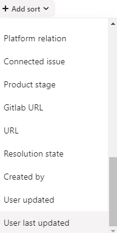

# Bug Ticket Project Fields

When managing bug tickets in Asana, we use several fields to categorize and track the progress of each issue. Understanding these fields is crucial for effective bug management.

## Key Fields

1. **Assignee**: The team member responsible for handling the issue.

2. **Projects**: The Asana projects associated with the issue.

3. **Dependencies**: Other issues that are blocking or blocked by this issue.

4. **Priority**: The urgency of the issue, ranging from Critical to Low.

5. **Assessment**: The verification status of the reported issue.

6. **Bug Type**: Indicates if the issue is new, a regression, an incident, or not a bug.

7. **Enterprise Client**: Indicates if the issue is connected to an enterprise account.

8. **User Account**: A link to the affected user's account.

9. **From**: The source of the bug report.

10. **Department**: The area of the platform related to the issue.

11. **Product Stage**: The current status of the issue in the product development process.

12. **Status**: The current status of the issue in the overall workflow.

13. **Resolution State**: Indicates how the issue was resolved.

14. **User Updated**: Indicates if the user has been notified of updates or resolution.

15. **Gitlab URL**: A link to any connected Gitlab merge request.

16. **Created By**: The team member who submitted the issue to Asana.

For a detailed explanation of each field, please refer to the [Project Fields Explanations](Project%20fields%20explanations%20feda69273a074e52add06f5af921818c.md) document.

