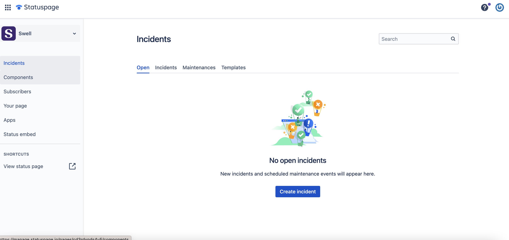
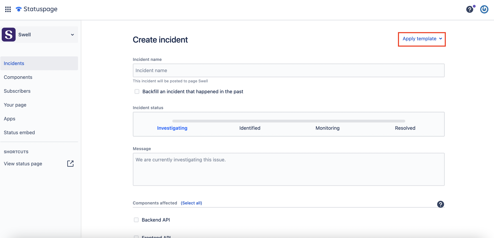
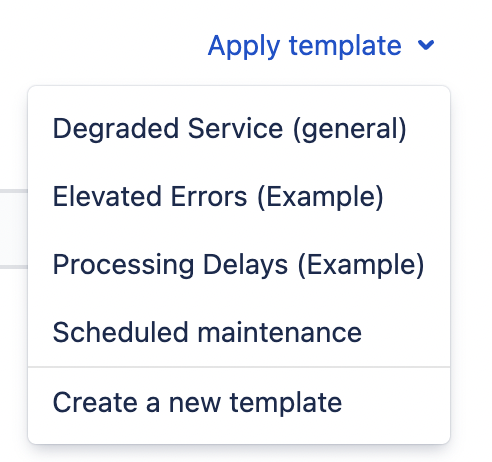
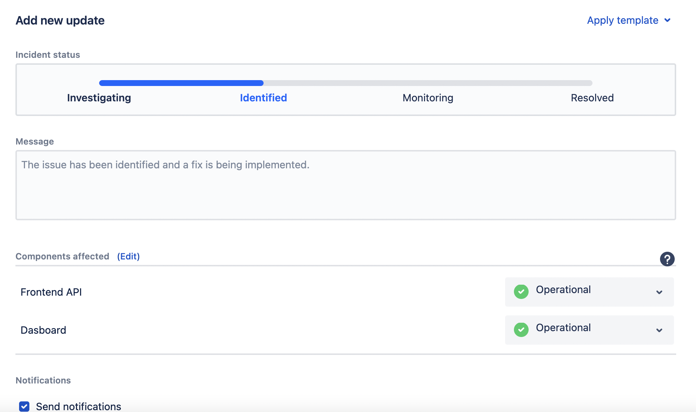

Our team uses [statuspage.io](http://statuspage.io/) to inform our customers about the status of our system. When we experience an incident, such as downtime or degraded performance, we update our status page with the details, including the nature of the incident, its impact, and our plans for resolution.

We aim to update the status page at least once per hour during incidents and continue to post updates until the issue is resolved. Once the incident is over, we post a final update summarizing the incident and any steps we're taking to prevent similar issues in the future.

In addition to using the status page for incident communication, we inform customers of scheduled maintenance. We aim to provide advance (**48 hours?**) notice for planned downtime.

If statuspage did not create an automated incident notice during an event, login to the statuspage dashboard [https://manage.statuspage.io/pages](https://manage.statuspage.io/pages).

Click on “Create Incident,” then select a template that matches the current event.

Here’s the list of templates available at the moment.

1. **Degraded Service:** Use this template when our systems are still operational but are not performing at their optimal level.
2. **Elevated Errors:** Depending on the feedback from our team, we can use this when our team mentions that we’re receiving more than the usual amount of errors in our logs.
3. **Processing Delays:** This is similar to the “Degraded Service” option, but use this when we’re having slowness issues on our API endpoints.
4. **Scheduled Maintenance:** This template should be used when planning to perform system maintenance that will/will not disrupt services.

Make sure to update the incident every hour or more, depending on the event. You can do so by opening the incident item and navigating to the “Add new update” section:

For the exact message templates for updates, we can refer to [Template for status page messages](https://www.notion.so/Template-for-status-page-messages-21d7bbd172ce4b868fc382def62ee601?pvs=21) for messaging templates that we can use (or review previous incidents and check the wording).
